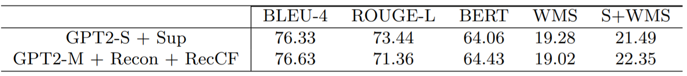
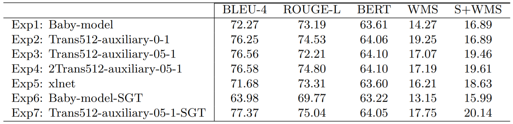

# Counterfactual Story Rewrite Based on Graph Transformer

## Requires
+ python>=3.6.2
+ Tensorflow-gpu==1.14.0
+ tensorflow-probability==0.7.0
+ Texar-0.2.4 (this version has been included in this repository)
+ xlnet_cased_L-12_H-768_A-12
+ torch-1.3.0
+ torchvision-0.3.0
+ spacy==2.0.0
+ nltk
+ rouge
+ edlib
+ pandas
+ boto3
+ allennlp
+ wmd (https://github.com/eaclark07/sms/tree/master/wmd-relax-master)
+ matplotlib
+ en_core_web_md-2.0.0.tar.gz
+ pytorch-pretrained-BERT-master
------

## Preprocessing
+ jdk 1.8
+ stanford-corenlp (<http://nlp.stanford.edu/software/stanford-corenlp-full-2018-02-27.zip>)
------

## Training
  + EXP1: python main_babymodel_1.1_lr.py
  + EXP2: python main_trans512_auxiliary_01_00.py
  + EXP3: python main_trans512_auxiliary_1_05.py
  + EXP4: python main_2trans512_auxiliary_1_05.py
  + EXP5: python main_xlnet.py
  + EXP6: python main_babymodel_1.1_lr_SGT.py
  + EXP7: python main_trans512_auxiliary_1_05_SGT.py
------
## evaling
  + EXP1: bash cmd_eval_babymodel1.1_lr.sh
  + EXP2: bash cmd_eval_transformer512_auxiliary_loss_1_00.sh
  + EXP3: bash cmd_eval_transformer512_auxiliary_loss_1_05.sh
  + EXP4: bash cmd_eval_2transformer512_auxiliary_loss_1_05.sh
  + EXP5: bash cmd_eval_xlnet.sh
  + EXP6: bash cmd_eval_babymodel1.1_lr_SGT.sh
  + EXP7: bash cmd_eval_transformer512_auxiliary_loss_1_05_SGT.sh
------
## Result
### **Results in paper "Counterfactual Story Reasoning and Generation"**

### **Results of Ours**

------
## TODO
 + check all the traning code again and clean the code
 + preprocessing for data
------
## Acknowledge
 + [Counterfactual-StoryRW](https://github.com/qkaren/Counterfactual-StoryRW "Counterfactual-StoryRW")
 + [Texar-tf](https://github.com/asyml/texar "Texar-tf")

